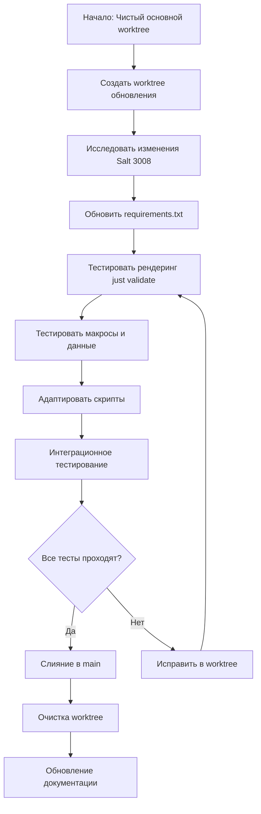

# Руководство по обновлению Salt 3008+ с использованием Git Worktrees

**Дата**: 2026-04-18  
**Статус**: Черновик / Планирование  
**Применимо к**: Masterless конфигурации рабочей станции Salt (CachyOS/Arch)  
**Текущая версия**: Salt 3007.13  
**Целевая версия**: Salt 3008+ LTS (когда будет доступна)

## Краткое описание

Это руководство описывает безопасный, изолированный подход к обновлению Salt с версии 3007.13 до 3008+ с использованием git worktrees. Методология обеспечивает:

- **Нулевое вмешательство** в рабочую конфигурацию во время тестирования
- **Полную изоляцию** изменений обновления в отдельном worktree
- **Пошаговую проверку** всех файлов состояний, макросов и данных
- **Контролируемую интеграцию** после успешного тестирования
- **Простой откат** путём удаления worktree

## Почему Git Worktrees?

### Преимущества перед традиционным workflow с ветками

| Аспект | Традиционные ветки | Git Worktree |
|--------|-------------------|--------------|
| **Изоляция** | Тот же каталог, риск случайных коммитов | Отдельный каталог, полная изоляция |
| **Параллельная работа** | Нужно stash/commit перед переключением | Можно работать в обоих одновременно |
| **Безопасность тестирования** | Риск сломать рабочую конфигурацию | Продакшн-конфигурация остаётся нетронутой |
| **Очистка** | Нужно reset/clean рабочего каталога | Просто удалить каталог worktree |
| **Существующая практика** | Стандартный git workflow | Уже используется в проекте (`.worktrees/`) |

### Контекст проекта

Этот проект уже использует git worktrees для параллельной разработки (см. каталог `.worktrees/`). Расширение этого шаблона для основных обновлений обеспечивает согласованность и снижает когнитивную нагрузку.

## Предварительные требования

### Системные требования
- Git 2.5+ (поддержка worktree)
- Python 3.12+ (совместимость с Salt 3008)
- Установленный Salt 3007.13
- Достаточно места на диске для дублирования репозитория

### Состояние репозитория
- Чистый рабочий каталог в основном worktree
- Все изменения закоммичены или в stash
- Нет неслитых веток

### Требования к знаниям
- Базовые команды git worktree
- Структура состояний Salt и инструменты тестирования
- Workflow команды `just` проекта

## Обзор процесса обновления



## Фаза 1: Настройка Worktree (1 день)

### 1.1 Создание Worktree для обновления

```bash
# Из основной директории репозитория
cd /home/neg/src/cfg

# Создать новый worktree с выделенной веткой
git worktree add .worktrees/salt-3008-upgrade -b upgrade/salt-3008

# Проверить создание
git worktree list
```

Ожидаемый вывод:
```
/home/neg/src/cfg                                145bad2 [main]
/home/neg/src/cfg/.worktrees/salt-3008-upgrade   145bad2 [upgrade/salt-3008]
```

### 1.2 Инициализация окружения Worktree

```bash
# Перейти в worktree
cd .worktrees/salt-3008-upgrade

# Настроить виртуальное окружение (если не наследуется из main)
python -m venv .venv
source .venv/bin/activate

# Установить текущие зависимости (базовая линия)
pip install -r requirements.txt

# Проверить работу инструментов
just --version
pytest --version
```

### 1.3 Базовая валидация

```bash
# Убедиться, что текущее состояние рендерится правильно (3007.13)
just validate

# Запустить быстрый smoke-тест
just test system_description

# Записать базовую производительность
just test system_description 2>&1 | tail -5 > /tmp/baseline-perf.txt
```

## Фаза 2: Исследование совместимости (2-3 дня)

### 2.1 Анализ изменений Salt 3008

**Критические области исследования:**

1. **Стабильность модулей** - Проверить, остаются ли основные модули в ядре Salt:
   - `file.managed`, `cmd.run`, `service.running`
   - `pkg.installed`, `mount.mounted`, `sysctl.present`
   - `kmod.present`, `timezone.system`

2. **Изменения Jinja2/YAML** - Критические изменения в шаблонизации:
   - Доступность функций фильтров
   - Поведение загрузки YAML
   - Доступ к переменным контекста

3. **Изменения производительности** - Новые настройки по умолчанию, влияющие на выполнение:
   - Поведение параллельного выполнения
   - Правила инвалидации кэша
   - Накладные расходы на компиляцию состояний

### 2.2 Источники данных

- Официальные release notes Salt 3008 (когда будут доступны)
- Блог Salt Project и анонсы
- GitHub issues с меткой `3008`
- Сигналы мониторинга в `docs/salt-best-practices.md`

### 2.3 Матрица оценки рисков

| Компонент | Уровень риска | Влияние | Стратегия снижения рисков |
|-----------|------------|--------|---------------------|
| Jinja макросы | Средний | Высокое | `just validate` всех состояний перед выполнением |
| YAML файлы данных | Низкий | Среднее | Валидация синтаксиса с `yamllint` |
| Модули Salt | Высокий | Критическое | Тестирование каждого типа модулей изолированно |
| Совместимость скриптов | Средний | Высокое | Обновление `salt_compat.py` по необходимости |
| Регрессии производительности | Средний | Среднее | Сравнение базовой линии с целевой |

## Фаза 3: Обновление зависимостей (1 день)

### 3.1 Обновление Requirements

```bash
# В директории worktree
cd .worktrees/salt-3008-upgrade

# Редактировать requirements.txt
sed -i 's/salt==3007.13/salt>=3008,<3009/' requirements.txt

# Проверить совместимость salt-lint
# Возможно потребуется обновить или временно отключить
```

### 3.2 Установка новых зависимостей

```bash
# Чистая установка в worktree
deactivate
rm -rf .venv
python -m venv .venv
source .venv/bin/activate

pip install -r requirements.txt

# Проверить установку
python -c "import salt; print(f'Версия Salt: {salt.__version__}')"
```

### 3.3 Проверка основных зависимостей

```bash
# Критические проверки зависимостей
python -c "import jinja2; print(f'Jinja2: {jinja2.__version__}')"
python -c "import yaml; print(f'PyYAML доступен')"
python -c "import tornado; print(f'Tornado: {tornado.version}')"

# Тестирование базовой функциональности Salt
python -c "
import salt.config
import salt.loader
opts = salt.config.minion_config(None)
grains = salt.loader.grains(opts)
print(f'Grains загружены: {bool(grains)}')
"
```

## Фаза 4: Валидация рендеринга (2 дня)

### 4.1 Всесторонняя валидация состояний

```bash
# Протестировать, что все файлы состояний рендерятся без ошибок
just validate

# Если валидация падает, диагностировать конкретные файлы
just validate-one system_description
just validate-some desktop hyprland

# Проверить сценарии feature matrix
just render-matrix
```

### 4.2 Специфичное тестирование макросов

```bash
# Создать тестовый рендеринг для сложных макросов
cat > /tmp/test_macro.j2 << 'EOF'

Test: {{ ensure_dir('test', '/tmp/test', mode='0755') }}

{{ user_service_file(service) }}
EOF

# Рендерить с jinja от Salt
python -c "
import jinja2
env = jinja2.Environment(
    loader=jinja2.FileSystemLoader(['states/']),
    extensions=['jinja2.ext.do']
)
template = env.from_string(open('/tmp/test_macro.j2').read())
print(template.render())
"
```

### 4.3 Валидация файлов данных

```bash
# Валидировать все YAML файлы данных
find states/data -name "*.yaml" -exec yamllint {} \;

# Тестировать загрузку YAML с парсером Salt
python -c "
import yaml
import salt.utils.yaml
with open('states/data/packages.yaml') as f:
    data = salt.utils.yaml.safe_load(f)
print(f'Категории пакетов: {len(data)}')
"
```

## Фаза 5: Адаптация скриптов (2 дня)

### 5.1 Совместимость Salt Daemon

Проверить `scripts/salt-daemon.py` на:
- Пути импорта модулей (могут измениться в 3008)
- Изменения API выполнения состояний
- Совместимость формата логов
- Стабильность socket-коммуникации

```bash
# Тестирование запуска демона (dry-run)
python scripts/salt-daemon.py --config-dir .salt_runtime --dry-run

# Проверить загрузку модулей
python -c "
import salt.loader
import salt.config
opts = salt.config.minion_config(None)
modules = salt.loader.minion_mods(opts)
print(f'Модулей загружено: {len(modules)}')
"
```

### 5.2 Обновление runner-скриптов

Обновить `scripts/salt-runner.py`:
- Изменения парсинга CLI аргументов
- Совместимость формата вывода
- Улучшения обработки ошибок

### 5.3 Обзор слоя совместимости

Проверить `scripts/salt_compat.py`:
- Удалить патчи для Python 3.13+, если исправлено в Salt 3008
- Обновить обработку URL, если изменился `salt://`
- Проверить совместимость multiprocessing

```bash
# Тестирование патчей совместимости
python -c "
import sys
sys.path.insert(0, 'scripts')
import salt_compat
salt_compat.patch()
print('Патчи совместимости применены')
"
```

## Фаза 6: Интеграционное тестирование (3-4 дня)

### 6.1 Стратегия dry-run тестирования

```bash
# Сначала протестировать базовую функциональность
just test system_description

# Пошаговое тестирование групп состояний
just test group core
just test group desktop
just test group packages
just test group services
just test group ai

# Проверить идемпотентность
just idempotency system_description
```

### 6.2 Бенчмаркинг производительности

```bash
# Зафиксировать базовую производительность
just test system_description 2>&1 | tee /tmp/salt-3008-perf.log

# Проанализировать с профилировщиком
just profile /tmp/salt-3008-perf.log

# Сравнить с базовой линией
just profile-compare /tmp/baseline-perf.txt /tmp/salt-3008-perf.log
```

### 6.3 Тестирование edge cases

```bash
# Тестировать сложные состояния с зависимостями
just test video_ai
just test ollama
just test nanoclaw

# Тестировать управление сервисами
just test user_services
just test systemd_resources

# Тестировать потоки установки пакетов
just test installers
just test custom_pkgs
```

## Фаза 7: Тестирование в виртуальной среде (1-2 дня)

### 7.1 Smoke-тест в CachyOS VM

```bash
# Подготовить тестовое окружение
just vm-smoke /mnt/one/cachyos-root

# Мониторить регрессии
tail -f logs/vm-smoke-*.log
```

### 7.2 Полное тестирование apply

```bash
# ВНИМАНИЕ: Только в изолированной VM среде
just apply system_description --test-run

# Проверить отсутствие деструктивных изменений
grep -i "failed\|error" logs/system_description-*.log
```

## Фаза 8: Интеграция в основную ветку (1 день)

### 8.1 Финальный чеклист валидации

- [ ] Все состояния рендерятся без ошибок (`just validate`)
- [ ] Dry-run проходит без изменений (`just test system_description`)
- [ ] Все тесты проходят (`pytest tests/`)
- [ ] Идемпотентность проверена (`just idempotency`)
- [ ] Производительность приемлема (`just profile-compare`)
- [ ] Документация обновлена
- [ ] План отката задокументирован

### 8.2 Процесс слияния

```bash
# Из основной директории worktree
cd /home/neg/src/cfg

# Убедиться, что ветка main чиста
git status

# Слить ветку обновления
git checkout main
git merge upgrade/salt-3008 --no-ff -m "[feat] upgrade to Salt 3008"

# Запустить финальную валидацию
just validate
just test system_description
pytest tests/ -v
```

### 8.3 Пост-слияние верификация

```bash
# Обновить виртуальное окружение в основной директории
deactivate
cd /home/neg/src/cfg
rm -rf .venv
python -m venv .venv
source .venv/bin/activate
pip install -r requirements.txt

# Финальный smoke-тест
just test group core
just test group desktop
```

## Фаза 9: Очистка и документация (1 день)

### 9.1 Очистка Worktree

```bash
# Удалить worktree
git worktree remove .worktrees/salt-3008-upgrade

# Удалить ветку (опционально)
git branch -d upgrade/salt-3008

# Проверить очистку
git worktree list
```

### 9.2 Обновление документации

Обновить следующие файлы:
1. `AGENTS.md` - Обновить версию Salt и заметки о совместимости
2. `docs/salt-best-practices.md` - Добавить руководство для 3008
3. `README.md` - Обновить ссылки на версии, если нужно
4. Это руководство - Конвертировать из черновика в справочник

### 9.3 Передача знаний

Создать документ-резюме:
- Критические изменения, с которыми столкнулись
- Реализованные обходные пути
- Характеристики производительности
- Рекомендации для будущих обновлений

## Стратегия управления рисками

### Критические риски и меры снижения

| Риск | Вероятность | Влияние | Меры снижения |
|------|------------|--------|------------|
| **Устаревание модулей Salt** | Средняя | Критическое | Тестировать каждый тип модуля; иметь fallback готовым |
| **Поломка рендеринга Jinja** | Низкая | Высокое | `just validate` перед любым выполнением |
| **Регрессия производительности** | Средняя | Среднее | Сравнение с базовой линией; профилирование рано |
| **Несовместимость скриптов** | Высокая | Высокое | Сначала обновлять скрипты в worktree |
| **Изменения формата данных** | Низкая | Среднее | Валидация YAML; постепенная миграция |

### Процедуры отката

**Сценарий 1: Тестирование в worktree проваливается**
```bash
# Просто удалить worktree
git worktree remove .worktrees/salt-3008-upgrade
git branch -d upgrade/salt-3008
```

**Сценарий 2: Слияние вызывает проблемы**
```bash
# Отменить слияние
git revert -m 1 <merge-commit>

# Или reset, если нет других изменений
git reset --hard HEAD~1
```

**Сценарий 3: Затронута продакшн система**
```bash
# Вернуться к предыдущей версии Salt в requirements.txt
sed -i 's/salt>=3008,<3009/salt==3007.13/' requirements.txt

# Переустановить зависимости
pip install -r requirements.txt --force-reinstall

# Применить известную-рабочую конфигурацию
just apply system_description
```

## Критерии успеха

### Обязательные (Блокирующие)
- [ ] Все 200+ файлов состояний рендерятся без ошибок
- [ ] Dry-run `system_description` не делает изменений
- [ ] Все существующие тесты проходят (`pytest tests/`)
- [ ] Идемпотентность проверена для основных состояний
- [ ] Нет регрессий в критической функциональности

### Желательные (Важные)
- [ ] Производительность в пределах 10% от базовой линии
- [ ] Все макросы работают корректно
- [ ] Файлы данных загружаются без предупреждений
- [ ] Скрипты обновлены и протестированы
- [ ] Документация завершена

### Опциональные
- [ ] Улучшения производительности от фич 3008
- [ ] Использованы новые возможности Salt 3008
- [ ] Улучшения качества кода
- [ ] Дополнительное покрытие тестами

## Приложения

### Приложение A: Шпаргалка команд Git Worktree

```bash
# Список worktrees
git worktree list

# Добавить новый worktree
git worktree add <path> [-b <branch>]

# Перемещаться между worktrees
cd <worktree-path>

# Удалить worktree
git worktree remove <path>

# Очистить устаревшие worktrees
git worktree prune
```

### Приложение B: Команды тестирования Salt

```bash
# Базовая валидация
just validate                    # Рендерить все состояния
just render-matrix              # Тестировать feature matrix
just test <state>              # Dry-run конкретного состояния
just test group <group>        # Dry-run группы состояний

# Продвинутое тестирование
just idempotency <state>       # Проверить идемпотентность
just profile <log>             # Профилировать производительность
just profile-trend             # Анализировать тренды
just profile-compare <a> <b>   # Сравнить два запуска

# Проверки качества
just lint                      # Запустить все линтеры
pytest tests/ -v              # Запустить набор тестов
```

### Приложение C: Полезные ресурсы по Salt 3008

1. **Официальная документация**
   - [Salt 3008 Release Notes](https://docs.saltproject.io/en/latest/topics/releases/3008.0.html)
   - [Migration Guide](https://docs.saltproject.io/en/latest/topics/releases/migration.html)

2. **Ресурсы сообщества**
   - Блог Salt Project
   - GitHub Discussions
   - Канал #salt в IRC

3. **Ссылки проекта**
   - `docs/salt-best-practices.md`
   - `docs/pyinfra-migration-research.md`
   - `AGENTS.md`

### Приложение D: Шаблон лога изменений

```markdown
## Обновление Salt 3008 - Лог изменений

### Критические изменения, с которыми столкнулись
1. **Изменения модулей**: [Описание]
2. **Изменения API**: [Описание]
3. **Изменения поведения**: [Описание]

### Реализованные обходные пути
1. [Проблема]: [Решение]
2. [Проблема]: [Решение]

### Влияние на производительность
- Компиляция состояний: ±X%
- Время выполнения: ±Y%
- Использование памяти: ±Z%

### Рекомендации
1. Для будущих обновлений: [Совет]
2. Изменения конфигурации: [Предложения]
3. Стратегия тестирования: [Улучшения]
```

## Заключение

Этот подход к обновлению на основе git worktrees обеспечивает максимальную безопасность и изоляцию для миграции на Salt 3008+. Тестируя в полностью отдельном окружении, вы можете:

1. **Избежать нарушения** вашей продакшн конфигурации
2. **Тщательно протестировать** без риска
3. **Быстро итерировать** над исправлениями
4. **Чисто интегрировать**, когда готовы
5. **Мгновенно откатиться**, если нужно

Методология соответствует существующим практикам проекта и предоставляет шаблон для будущих основных обновлений Salt или других критических компонентов инфраструктуры.

**Следующие шаги**: Начать Фазу 1, когда будет выпущен Salt 3008 LTS и завершено начальное исследование совместимости.
```

---

*Версия документа: 1.0*  
*Последнее обновление: 2026-04-18*  
*Ответственный: Команда инфраструктуры*  
*Основано на: Существующей конфигурации Salt 3007.13 проекта и практике git worktree*