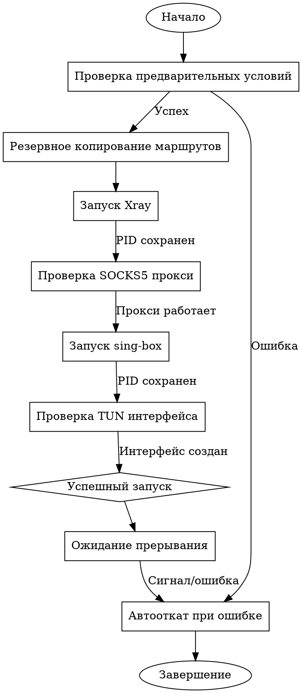

# Спецификация: Временное перенаправление всего трафика через VPN с проверками и автооткатом

**Дата:** 2026-04-20  
**Статус:** Черновик  
**Автор:** opencode  
**Версия:** 1.0

## Контекст

Пользователь хочет временно перенаправить весь системный трафик через VPN на время сессии. В системе уже настроена гибридная VPN-схема (Xray + sing-box) с SOCKS5-прокси на 127.0.0.1:10808 и возможностью создания TUN-интерфейса. Существует скрипт `scripts/start-hybrid-vpn.sh`, который запускает эту схему, но требует улучшений в области проверок работоспособности и автоматического отката при сбоях.

## Цель

Модифицировать скрипт `start-hybrid-vpn.sh` для добавления:
1. Базовых проверок работоспособности VPN на этапах запуска
2. Автоматического отката конфигурации маршрутизации при обнаружении сбоев
3. Улучшенного управления ошибками и очистки ресурсов

## Требования

### Функциональные требования
1. **Предстартовые проверки:**
   - Проверка наличия и доступности бинарных файлов Xray и sing-box
   - Проверка существования и валидности конфигурационных файлов
   - Проверка отсутствия конфликтов портов (10808)

2. **Постстартовые проверки:**
   - Проверка работы SOCKS5-прокси (тестовый запрос через `curl`)
   - Проверка создания TUN-интерфейса `sb0`
   - Проверка корректности добавленных маршрутов

3. **Автооткат:**
   - При любой ошибке запуска выполнять полную очистку: остановка процессов, удаление TUN-интерфейса, восстановление маршрутов
   - Использование `trap` для гарантированной очистки при прерывании (Ctrl+C) или ошибках
   - Логирование ошибок в stderr для диагностики

4. **Управление сессией:**
   - Скрипт должен работать в foreground до явного прерывания (Ctrl+C)
   - При прерывании выполнять полную очистку ресурсов

### Нефункциональные требования
1. **Минимальное влияние:** Не изменять постоянную конфигурацию системы
2. **Отказоустойчивость:** Гарантированный откат при любом сценарии ошибки
3. **Простота использования:** Один скрипт для запуска/остановки с понятным выводом

## Дизайн

### Архитектура

```
[Пользователь] -> [start-hybrid-vpn.sh] -> [Xray (SOCKS5)] -> [VPN сервер]
                          |
                          +-> [sing-box (TUN)] -> [Маршрутизация всего трафика]
```

### Компоненты

1. **Модифицированный скрипт `start-hybrid-vpn.sh`:**
   - Основной скрипт управления с расширенными проверками
   - Функции проверки (`check_prerequisites`, `test_vpn_connection`)
   - Улучшенный механизм очистки (`cleanup`) с откатом маршрутов
   - Централизованная обработка ошибок

2. **Механизм проверок (базовый уровень):**
   - `check_binaries()`: Проверка наличия и исполняемости Xray и sing-box
   - `check_configs()`: Проверка существования и валидности конфигурационных файлов
   - `test_socks5_proxy()`: Проверка работоспособности SOCKS5-прокси через тестовый запрос
   - `verify_tun_interface()`: Проверка создания и конфигурации TUN-интерфейса `sb0`

3. **Механизм автоотката:**
   - `backup_routes()`: Сохранение текущих маршрутов перед изменениями
   - `restore_routes()`: Восстановление маршрутов при откате
   - Единая точка очистки через `trap` для всех сценариев выхода

### Поток выполнения



### Обработка ошибок

1. **Ранние ошибки:** Откат до внесения изменений (простое сообщение об ошибке)
2. **Ошибки после запуска Xray:** Остановка Xray, очистка временных файлов
3. **Ошибки после создания TUN:** Остановка обоих процессов, удаление интерфейса, восстановление маршрутов
4. **Сигналы (SIGINT, SIGTERM):** Корректная очистка через `trap`

## Проверки работоспособности

### Уровень 1: Предстартовые проверки
1. Бинарные файлы существуют и исполняемы
2. Конфигурационные файлы существуют и имеют корректный синтаксис
3. Порт 10808 свободен (или занят существующим Xray процессом)

### Уровень 2: Постстартовые проверки
1. Xray процесс запущен и слушает порт 10808
2. SOCKS5-прокси отвечает на тестовый запрос (`curl --socks5`)
3. Sing-box процесс запущен
4. TUN-интерфейс `sb0` создан и имеет IP-адрес
5. Маршруты через TUN-интерфейс добавлены в таблицу маршрутизации

### Критерии успешного запуска
- Все проверки уровня 1 и 2 пройдены
- Пользователь видит сообщение "✅ HYBRID VPN RUNNING SUCCESSFULLY"
- Скрипт продолжает работу в foreground до прерывания

## Автооткат

### Сценарии отката
1. **Ошибка предстартовой проверки:** Выход без изменений
2. **Ошибка запуска Xray:** Выход с сообщением об ошибке
3. **Ошибка проверки SOCKS5:** Остановка Xray, выход
4. **Ошибка запуска sing-box:** Остановка Xray, выход
5. **Ошибка проверки TUN:** Остановка обоих процессов, удаление интерфейса (если создан), восстановление маршрутов
6. **Прерывание пользователем (Ctrl+C):** Полная очистка, корректный выход

### Восстановление состояния
- Процессы: Остановка через `kill` (SIGTERM, затем SIGKILL при необходимости)
- TUN-интерфейс: `ip link delete sb0`
- Маршруты: Восстановление из резервной копии или удаление добавленных маршрутов
- Порт: Освобождение порта 10808 после остановки Xray

## План реализации

### Фаза 1: Анализ текущего скрипта
1. Изучить существующий скрипт `start-hybrid-vpn.sh`
2. Определить точки расширения для проверок
3. Проанализировать текущий механизм очистки

### Фаза 2: Добавление функций проверки
1. Реализовать `check_prerequisites()` для предстартовых проверок
2. Реализовать `test_vpn_connection()` для проверки SOCKS5-прокси
3. Реализовать `verify_tun_setup()` для проверки TUN-интерфейса

### Фаза 3: Улучшение механизма очистки
1. Добавить `backup_routes()` для сохранения текущих маршрутов
2. Модифицировать `cleanup()` для использования резервных копий
3. Усилить обработку `trap` для всех сигналов

### Фаза 4: Интеграция и тестирование
1. Интегрировать новые функции в основной поток выполнения
2. Протестировать различные сценарии ошибок
3. Убедиться в корректности автоотката

### Фаза 5: Документация
1. Обновить inline-комментарии в скрипте
2. Обновить документацию `docs/vpn-quickstart.ru.md`
3. Добавить примеры использования с новыми функциями

## Риски и ограничения

### Риски
1. **Конфликт портов:** Если порт 10808 занят другим приложением, потребуется ручное разрешение
2. **Права доступа:** Для создания TUN-интерфейса могут потребоваться расширенные права
3. **Конфликт маршрутов:** Существующие маршруты могут конфликтовать с VPN-маршрутами

### Ограничения
1. **Временное решение:** Конфигурация действует только во время работы скрипта
2. **Базовая проверка:** Не включает мониторинг стабильности или скорость-тесты
3. **Зависимость от внешних сервисов:** Проверки используют внешние тестовые endpoints

## Критерии приемки

1. Скрипт успешно запускает гибридную VPN-схему при наличии всех предварительных условий
2. При ошибке на любом этапе выполняется полный откат без оставшихся артефактов
3. Прерывание скрипта (Ctrl+C) корректно очищает все ресурсы
4. Пользователь получает понятные сообщения о статусе на каждом этапе
5. Существующая функциональность (работающий VPN) не нарушена

## Следующие шаги

После утверждения этой спецификации:
1. Создать детальный план реализации с использованием skill `writing-plans`
2. Реализовать изменения в скрипте `start-hybrid-vpn.sh`
3. Протестировать все сценарии запуска и отката
4. Обновить документацию